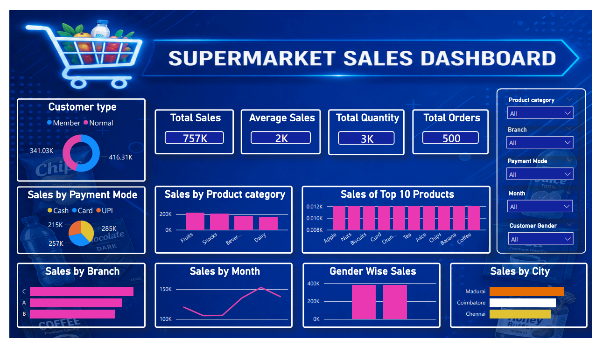

# 🛒 Supermarket Sales Dashboard

## 📌 Project Overview

This project presents an interactive Power BI dashboard developed using a supermarket sales dataset.

The dashboard helps analyze sales performance, customer behavior, payment methods, and product performance.

---

## 🛠 Tools Used

- Microsoft Excel
- Power BI
- DAX

---

## 📊 Dashboard Features

- Total Sales KPI
- Total Orders
- Total Sold Quantity
- Average Sales
- Sales by Product Category
- Sales by Branch
- Sales by City
- Monthly Sales Trend
- Top 10 Products
- Payment Mode Analysis
- Customer Type Analysis
- Interactive Slicers

---

## 📈 Business Insights

- Identify top-selling products
- Analyze branch-wise performance
- Compare city-wise sales
- Track monthly sales trends
- Understand customer payment preferences

---

## 📷 Dashboard Preview

---

## 📂 Files Included

- Supermarket_Sales_Dashboard.pbix
- Supermarket_Sales_500_Rows.xlsx
- Dashboard.pdf
- Dashboard.png

---
